<!-- Header -->

  

  

  
  
  
  
  

  

---

## 🧬 About me

I'm a PhD researcher (Senior Research Fellow) in the **Department of Chemical and Biological Sciences, S. N. Bose National Centre for Basic Sciences, Kolkata**. I use molecular simulation and data-driven methods to find **allosteric and cryptic binding sites** and to **modulate protein–protein interactions (PPIs)** for drug discovery.

- 🔬 **Current focus:** mixed-solvent / mixed amino-acid MD for PPI hotspot and cryptic-pocket mapping (PLK1 PBD, PCSK9)
- ⚗️ **Methods:** all-atom MD, enhanced sampling, alchemical free energy, neural-network potentials (ANI-2x in GROMACS), docking and ML rescoring, structural-ensemble generation (BioEmu)
- 🎯 **Looking for:** postdoctoral positions in computational biophysics, allostery and structure-based drug design

## 🧪 Mixed-solvent MD in action

  

Cosolvent probes sample the protein surface, residing longer at PPI hotspots and seeding a transient cryptic pocket, the idea behind <a href="https://doi.org/10.1007/s12039-025-02449-9">PPIscout</a> and my PLK1 / PCSK9 allosteric-pocket work.

## 🛠️ Toolbox

  

  
  
  
  
  
  
  
  
  

## 🚀 Featured project

<table>
<tr>
<td width="100%">

### [vina-rescore](https://github.com/mukherjeesutanu/vina-rescore)
Interaction-fingerprint (PLIF) rescoring of AutoDock Vina poses for **early enrichment** in virtual screening. It uses scaffold-aware cross-validation, LightGBM on ProLIF bitvectors, and BEDROC/EF with bootstrap confidence intervals. It removes Vina's ligand-size bias and recovers the canonical CDK2 hinge Leu83 H-bond as the top discriminative feature.

`Python` · `RDKit` · `ProLIF` · `MDAnalysis` · `LightGBM` · `AutoDock Vina`

</td>
</tr>
</table>

## 📄 Selected publications

| Year | Publication |
|:---:|---|
| 2026 | **Mapping PPI hotspots and unveiling a cryptic allosteric pocket in PLK1 PBD via mixed-solvent MD** — *ChemPhysChem* · [doi](https://doi.org/10.1002/cphc.202500907) |
| 2026 | **Computational strategies for allosteric drug discovery: from cryptic pocket detection to rational design** — *Chem. Commun.* · [doi](https://doi.org/10.1039/d5cc06159h) |
| 2025 | **Mixed-solvent MD reveals a druggable allosteric pocket in the PCSK9 C-terminal domain** — *J. Phys. Chem. B* · [doi](https://doi.org/10.1021/acs.jpcb.5c05530) |
| 2025 | **PPIscout: PPI hotspot mapping using mixed amino acid–water MD** — *J. Chem. Sci.* · [doi](https://doi.org/10.1007/s12039-025-02449-9) |
| 2025 | **Harnessing allostery to modulate protein–protein interactions: from function to therapeutic innovations** — *J. Mol. Biol.* · [doi](https://doi.org/10.1016/j.jmb.2025.169382) |
| 2024 | **Conformational and binding behaviour of human serum albumin induced by surface-active ionic liquids** — *J. Phys. Chem. B* · [doi](https://doi.org/10.1021/acs.jpcb.4c01915) |
| 2024 | **Allosteric hotspots and cryptic sites to modulate PPIs: a molecular thermodynamic approach** — *Biophys. J.* · [doi](https://doi.org/10.1016/j.bpj.2023.11.458) |
| 2022 | **A multidrug efflux protein in *M. tuberculosis*: Tap as a drug-repurposing target** — *Comput. Biol. Med.* · [doi](https://doi.org/10.1016/j.compbiomed.2022.105607) |

Full list on <a href="https://scholar.google.com/citations?user=9pwowmcAAAAJ&hl=en">Google Scholar</a>.

## 📊 GitHub activity

  
  

  <picture>
    <source media="(prefers-color-scheme: dark)" srcset="https://raw.githubusercontent.com/mukherjeesutanu/mukherjeesutanu/output/github-snake-dark.svg" />
    <source media="(prefers-color-scheme: light)" srcset="https://raw.githubusercontent.com/mukherjeesutanu/mukherjeesutanu/output/github-snake.svg" />
    
  </picture>

<!-- Footer -->

  

